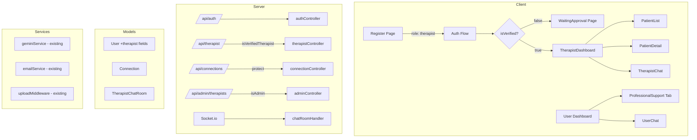
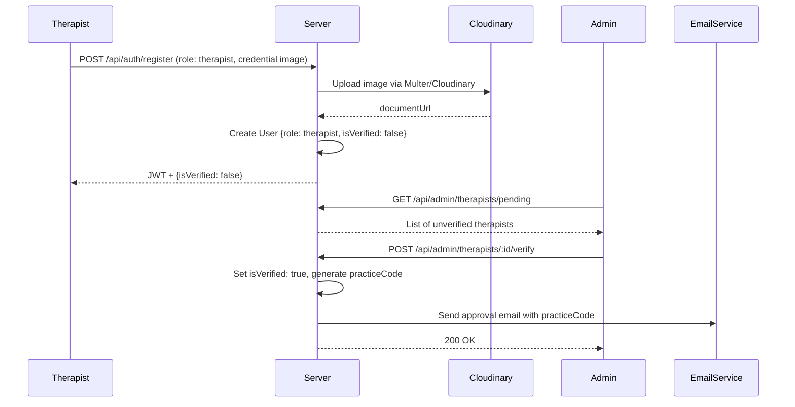
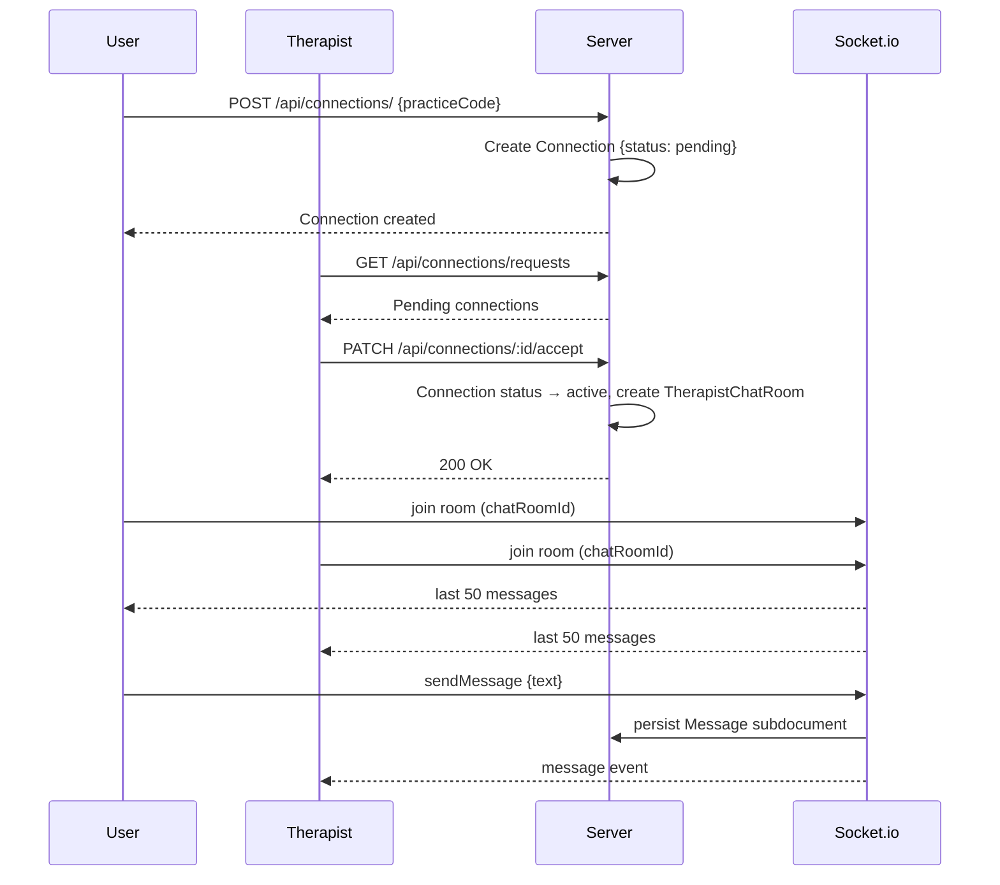

# Design Document: Therapist Module

## Overview

The Therapist Module adds a professional support layer to the existing MERN-stack mental health journaling app (equil). It introduces a verified therapist role, an admin-controlled credential verification workflow, a practice-code-based connection system, a read-only therapist dashboard with AI-powered patient insights, and real-time Socket.io chat between connected therapists and users.

The design builds entirely on existing infrastructure: JWT auth, the `protect` middleware, Multer/Cloudinary upload middleware, Gemini AI services, Socket.io, and the Admin dashboard. New models (`Connection`, `TherapistChatRoom`) and a new middleware (`isVerifiedTherapist`) are added with minimal changes to existing code.

---

## Architecture



### Request Flow: Therapist Verification



### Request Flow: Connection & Chat



---

## Components and Interfaces

### Backend Routes

#### `/api/auth/` (extended)
- `POST /register` — extended to accept `role: 'therapist'`, `licenseNumber`, `specialization`, and credential image upload via `upload.single('credential')`

#### `/api/therapist/` (new, all protected by `isVerifiedTherapist`)
- `GET /patients` — list active patients with last journal date and current mood
- `GET /patients/:userId` — patient detail: 30-day mood chart data + AI summary + optional raw journals
- `GET /chat-rooms` — list therapist's active chat rooms

#### `/api/connections/` (new, protected by `protect`)
- `POST /` — user submits practice code to create a pending connection
- `GET /my` — user gets their current connection status
- `GET /requests` — therapist gets pending connection requests (also requires `isVerifiedTherapist`)
- `PATCH /:id/accept` — therapist accepts a connection (also requires `isVerifiedTherapist`)
- `DELETE /:id` — therapist declines a connection (also requires `isVerifiedTherapist`)

#### `/api/admin/therapists/` (new, protected by `isAdmin`)
- `GET /pending` — list unverified therapist accounts
- `POST /:id/verify` — approve therapist, generate practice code, send email
- `DELETE /:id/reject` — reject therapist, delete user + Cloudinary asset, send email

#### `/api/user/` (extended)
- `PATCH /privacy-toggle` — toggle `shareJournalsWithTherapist` boolean

### Frontend Pages & Components

| Component | Route | Description |
|---|---|---|
| `WaitingApproval` | `/pending-approval` | Shown to unverified therapists |
| `TherapistDashboard` | `/therapist` | Root layout for therapist views |
| `PatientList` | `/therapist/patients` | Table of active patients |
| `PatientDetail` | `/therapist/patients/:id` | Mood chart + AI summary + optional journals |
| `TherapistChat` | `/therapist/chat/:roomId` | Real-time chat UI |
| `ProfessionalSupport` | Tab in `/profile` | Practice code input + connection status |
| `UserTherapistChat` | `/chat/therapist/:roomId` | User-side real-time chat UI |

### New Middleware

```javascript
// server/middleware/therapistMiddleware.js
const isVerifiedTherapist = (req, res, next) => {
    if (req.user?.role !== 'therapist') {
        return res.status(403).json({ message: 'Access denied: therapist role required' });
    }
    if (!req.user?.isVerified) {
        return res.status(403).json({ message: 'Access denied: therapist verification pending' });
    }
    next();
};
```

### Socket.io Events (Therapist Chat)

| Event | Direction | Payload | Description |
|---|---|---|---|
| `joinTherapistRoom` | Client → Server | `{ chatRoomId }` | Join a chat room |
| `therapistMessage` | Client → Server | `{ chatRoomId, text }` | Send a message |
| `therapistMessage` | Server → Client | `{ senderId, text, timestamp }` | Broadcast new message |
| `therapistHistory` | Server → Client | `Message[]` (last 50) | Initial message load on join |

---

## Data Models

### User Model (extended)

```javascript
// New fields added to existing userSchema
role: {
    type: String,
    enum: ['user', 'admin', 'therapist'],  // 'therapist' added
    default: 'user'
},
// Therapist-specific fields (only populated when role === 'therapist')
isVerified: { type: Boolean, default: false },
licenseNumber: { type: String },
specialization: { type: String },
documentUrl: { type: String },
practiceCode: { type: String, unique: true, sparse: true },
// User privacy field
shareJournalsWithTherapist: { type: Boolean, default: false }
```

### Connection Model (new)

```javascript
// server/models/Connection.js
{
    userId:      { type: ObjectId, ref: 'User', required: true },
    therapistId: { type: ObjectId, ref: 'User', required: true },
    status:      { type: String, enum: ['pending', 'active'], default: 'pending' },
    createdAt:   Date,
    updatedAt:   Date
}
// Compound unique index: { userId: 1, therapistId: 1 }
```

### TherapistChatRoom Model (new)

```javascript
// server/models/TherapistChatRoom.js
{
    therapistId: { type: ObjectId, ref: 'User', required: true },
    userId:      { type: ObjectId, ref: 'User', required: true },
    messages: [{
        senderId:  { type: ObjectId, ref: 'User', required: true },
        text:      { type: String, required: true },
        timestamp: { type: Date, default: Date.now }
    }]
}
// Index: { therapistId: 1, userId: 1 } (unique)
```

> Note: `TherapistChatRoom` is a separate model from the existing `ChatSession` model. `ChatSession` is used exclusively for AI (Gemini) conversations. `TherapistChatRoom` handles human-to-human real-time messaging.

### Practice Code Generation

```javascript
// Generates a unique 6-char alphanumeric code with up to 10 retry attempts
const generatePracticeCode = async () => {
    const chars = 'ABCDEFGHIJKLMNOPQRSTUVWXYZ0123456789';
    for (let attempt = 0; attempt < 10; attempt++) {
        const code = Array.from({ length: 6 }, () =>
            chars[Math.floor(Math.random() * chars.length)]
        ).join('');
        const exists = await User.findOne({ practiceCode: code });
        if (!exists) return code;
    }
    throw new Error('Failed to generate unique practice code after 10 attempts');
};
```

---

## Correctness Properties

*A property is a characteristic or behavior that should hold true across all valid executions of a system — essentially, a formal statement about what the system should do. Properties serve as the bridge between human-readable specifications and machine-verifiable correctness guarantees.*

### Property 1: Therapist registration produces correct document shape

*For any* valid therapist registration payload (name, email, password, licenseNumber, specialization, documentUrl), the resulting User document SHALL have `role: 'therapist'`, `isVerified: false`, and all provided fields populated with non-empty values.

**Validates: Requirements 1.1, 1.4**

---

### Property 2: Credential upload rejects non-image formats

*For any* file upload during therapist registration, the upload middleware SHALL accept the file if and only if its mime type is one of `image/jpeg`, `image/jpg`, or `image/png`; all other mime types SHALL be rejected.

**Validates: Requirements 1.2**

---

### Property 3: Incomplete registration is rejected

*For any* therapist registration payload missing `licenseNumber` or `documentUrl`, the system SHALL return a 400 error response with a non-empty validation message, and no User document SHALL be created.

**Validates: Requirements 1.3**

---

### Property 4: isVerifiedTherapist middleware enforces role and verification

*For any* request user object, the `isVerifiedTherapist` middleware SHALL call `next()` if and only if `role === 'therapist'` AND `isVerified === true`; for all other combinations it SHALL return a 403 response with an appropriate message.

**Validates: Requirements 2.2, 11.1, 11.2, 11.3**

---

### Property 5: Practice code format invariant

*For any* therapist approval action, the generated `practiceCode` SHALL be exactly 6 characters long and consist only of uppercase letters (A–Z) and digits (0–9).

**Validates: Requirements 4.1**

---

### Property 6: Practice codes are globally unique

*For any* set of N therapist approvals, all resulting `practiceCode` values SHALL be distinct — no two therapists SHALL share the same code.

**Validates: Requirements 4.2**

---

### Property 7: Connection creation with valid practice code

*For any* user and any verified therapist whose `practiceCode` is submitted, the system SHALL create a `Connection` document with `status: 'pending'`, `userId` matching the submitting user, and `therapistId` matching the therapist.

**Validates: Requirements 5.1**

---

### Property 8: Invalid practice code returns 404

*For any* string that does not match the `practiceCode` of any verified therapist in the database, submitting it as a connection request SHALL return a 404 response with the message "Practice code not found".

**Validates: Requirements 5.2**

---

### Property 9: Pending connection list is correctly filtered

*For any* therapist, the connection requests endpoint SHALL return only `Connection` documents where `therapistId` matches that therapist AND `status === 'pending'`; documents with other statuses or other therapist IDs SHALL NOT appear.

**Validates: Requirements 6.1**

---

### Property 10: Accepting a connection activates it and creates a chat room

*For any* pending `Connection` document, when the linked therapist accepts it, the `Connection` status SHALL become `'active'` AND a `TherapistChatRoom` document SHALL be created with matching `therapistId`, `userId`, and an empty `messages` array.

**Validates: Requirements 6.2, 10.1**

---

### Property 11: AI summary uses at most 10 analyses and no raw text

*For any* patient with N Analysis documents, the prompt sent to the Gemini AI summary service SHALL include at most 10 analyses (the most recent), SHALL contain `mood`, `sentimentScore`, `distortions`, and `keywords` fields from those analyses, and SHALL NOT contain any raw journal entry text.

**Validates: Requirements 8.3**

---

### Property 12: Privacy toggle controls raw journal exposure

*For any* patient, when `shareJournalsWithTherapist` is `false`, the patient detail API response SHALL NOT include raw journal entry text; when `shareJournalsWithTherapist` is `true`, the response SHALL include raw journal entry text.

**Validates: Requirements 8.4, 8.5, 9.2, 9.3, 9.4**

---

### Property 13: Message persistence and authorization

*For any* `TherapistChatRoom`, a message sent by the linked therapist or user SHALL be persisted as a subdocument with `senderId`, `text`, and `timestamp`; a message sent by any other user SHALL return a 403 error.

**Validates: Requirements 10.2, 10.5**

---

### Property 14: Chat history load is capped at 50 messages

*For any* `TherapistChatRoom` with N messages, when a client joins the Socket.io room, the server SHALL emit exactly `min(N, 50)` messages to that client.

**Validates: Requirements 10.3**

---

### Property 15: 30-day mood chart data is correctly bounded

*For any* patient, the mood chart data endpoint SHALL return only `Analysis` documents with `createdAt` within the last 30 days; analyses older than 30 days SHALL be excluded.

**Validates: Requirements 8.1**

---

## Error Handling

| Scenario | HTTP Status | Message |
|---|---|---|
| Registration missing licenseNumber or credential | 400 | Descriptive validation message |
| Invalid credential file format | 400 | "Only JPG, PNG, and JPEG images are allowed" |
| Practice code not found | 404 | "Practice code not found" |
| Duplicate connection (pending or active) | 409 | "Connection already exists" |
| Verify/reject non-existent or already-verified therapist | 404 | "Therapist not found" |
| Practice code generation exhausted (10 attempts) | 500 | "Failed to generate unique practice code" |
| Non-therapist accessing `/api/therapist/` | 403 | "Access denied: therapist role required" |
| Unverified therapist accessing `/api/therapist/` | 403 | "Access denied: therapist verification pending" |
| Unauthorized chat room message sender | 403 | "Access denied: not a participant in this chat room" |
| Cloudinary upload failure | 500 | "File upload failed" |

### Cloudinary Cleanup on Rejection

When an admin rejects a therapist, the `documentUrl` stored on the User document contains a Cloudinary public ID. The rejection handler extracts the public ID from the URL and calls `cloudinary.uploader.destroy()` before deleting the User document. If Cloudinary deletion fails, the User document is still deleted and the error is logged (non-blocking).

---

## Testing Strategy

### Unit Tests (example-based)

- `isVerifiedTherapist` middleware: test all four role/verification combinations
- `generatePracticeCode`: test format, uniqueness retry logic, and 10-attempt failure
- `connectionController.create`: test valid code, invalid code (404), duplicate (409)
- `connectionController.accept`: test status transition and ChatRoom creation
- `therapistController.getPatientDetail`: test privacy toggle branching (raw text included/excluded)
- `adminController.verifyTherapist`: test approval flow, email call, practice code assignment
- `adminController.rejectTherapist`: test deletion flow, Cloudinary cleanup call, email call

### Property-Based Tests

Using **fast-check** (JavaScript PBT library). Each property test runs a minimum of **100 iterations**.

| Property | Test Description | fast-check Arbitraries |
|---|---|---|
| P1: Registration document shape | Generate random therapist payloads, verify document fields | `fc.record({ name: fc.string(), email: fc.emailAddress(), licenseNumber: fc.string() })` |
| P2: Credential upload format filter | Generate random mime types, verify accept/reject logic | `fc.string()` for mime type |
| P3: Incomplete registration rejected | Generate payloads missing required fields, verify 400 | `fc.record(...)` with omitted fields |
| P4: Middleware role/verification matrix | Generate all combinations of role and isVerified, verify next()/403 | `fc.record({ role: fc.constantFrom('user','admin','therapist'), isVerified: fc.boolean() })` |
| P5: Practice code format | Generate N approvals, verify each code is 6-char alphanumeric | `fc.nat({ max: 100 })` for count |
| P6: Practice code uniqueness | Generate N approvals, verify all codes are distinct | `fc.nat({ max: 50 })` for count |
| P7: Connection creation | Generate user/therapist pairs with valid codes, verify Connection shape | `fc.record(...)` |
| P8: Invalid practice code → 404 | Generate random strings not matching any code, verify 404 | `fc.string({ minLength: 1, maxLength: 10 })` |
| P9: Pending connection filter | Generate mixed connection data, verify endpoint filter | `fc.array(fc.record(...))` |
| P10: Accept → active + ChatRoom | Generate pending connections, verify post-accept state | `fc.record(...)` |
| P11: AI summary prompt constraints | Generate patients with varying analysis counts, verify prompt | `fc.array(fc.record(...), { maxLength: 20 })` |
| P12: Privacy toggle controls exposure | Generate patients with both toggle states, verify response | `fc.boolean()` for toggle |
| P13: Message auth | Generate ChatRooms + random sender IDs, verify 403 for non-participants | `fc.record(...)` |
| P14: Chat history cap | Generate ChatRooms with 0–100 messages, verify emit count | `fc.array(fc.record(...), { maxLength: 100 })` |
| P15: 30-day chart filter | Generate analyses with varying dates, verify date filter | `fc.date()` |

Each property test is tagged with:
```javascript
// Feature: therapist-module, Property N: <property_text>
```

### Integration Tests

- Full therapist registration → admin approval → user connection → chat flow (end-to-end with test DB)
- Socket.io room join and message broadcast (using `socket.io-client` in tests)
- Cloudinary upload (mocked in unit tests, real in integration)
- Email notification delivery (mocked in unit tests)

### Frontend Tests

- `WaitingApproval` renders license number and status message (React Testing Library)
- `PatientList` renders correct columns for active patients
- `ProfessionalSupport` tab shows correct connection status for all three states (none/pending/active)
- `TherapistRoute` guard redirects unverified therapists to `/pending-approval`
